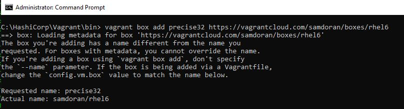
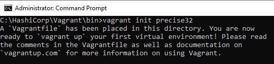
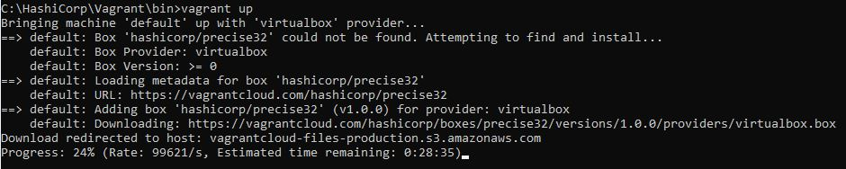
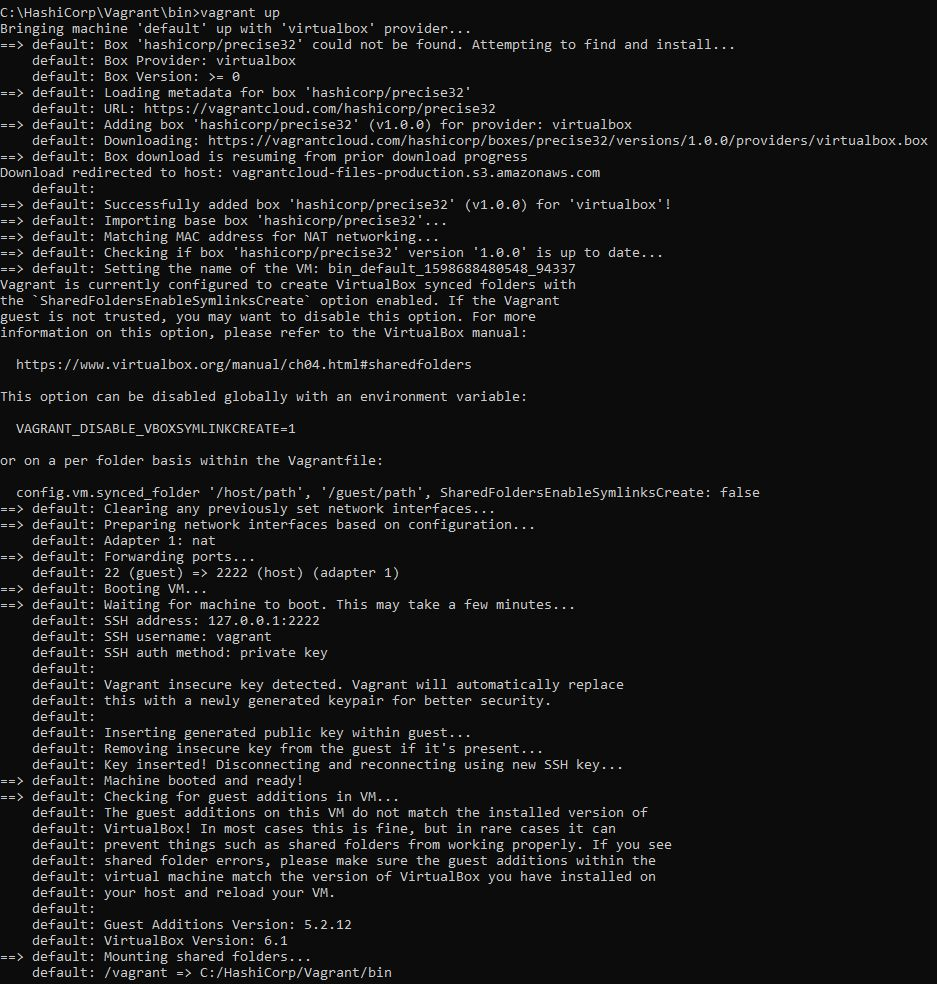
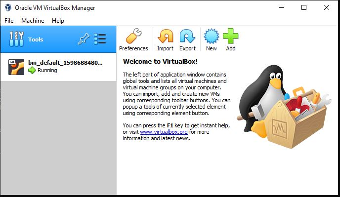
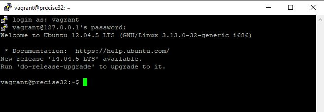

:+1: :sparkles: :camel: :tada: :rocket: :metal: :octocat:
# Vagrant Configuration


**Vagrant** is an open-source software product for building and maintaining portable virtual software development environments; e.g., for VirtualBox, KVM, Hyper-V, Docker containers, VMware, and AWS. It tries to simplify the software configuration management of virtualizations in order to increase development productivity. Vagrant is written in the Ruby language, but its ecosystem supports development in a few languages.

**Vagrant** is a tool for building and managing virtual machine environments in a single workflow. With an easy-to-use workflow and focus on automation, Vagrant lowers development environment setup time, increases production parity, and makes the "works on my machine" excuse a relic of the past.

**Step 1:**
Install VirtualBox (latest). https://www.virtualbox.org/wiki/Downloads

**Step 2:**
Install Vagrant (latest). https://www.vagrantup.com/downloads.html

**Step 3:**
Open the cmd and change the directory to C:\HashiCorp\Vagrant\bin>
Then type the following commands:

```bash
C:\HashiCorp\Vagrant\bin> vagrant box add precise32 <provider virtualbox>

C:\HashiCorp\Vagrant\bin> vagrant box add precise32 https://vagrantcloud.com/samdoran/boxes/rhel6
```



**You can find many boxes on this links:**

 <http://www.vagrantbox.es/>  
 
 <https://app.vagrantup.com/boxes/search>

After successfully adding the BOX for the first time you need to initiate so that the vagrantfile will be created and
you can open this file in notepad & you can customize Hostname, IP Address, ssh ports etc., based on your needs.

```bash
C:\HashiCorp\Vagrant\bin> vagrant init hashicorp/precise32
```


**Vagrant file path** ==> C:\HashiCorp\Vagrant\bin\Vagrantfile


After initiation, you can simply run the VM just by command vagrant up 

```bash
C:\HashiCorp\Vagrant\bin> vagrant up
```


 

**Step 4:**
Now open the VirtualBox

 

**Step 5:**
Now Let's connect to the ubuntu machine by accessing via SSH using putty

Open Putty & enter the following information. I got the IP address of 127.0.0.1 with Port 2222 (**Check "vagrant up" Screentshot**)

**Username:** vagrant

**Password:** vagrant

 

---

# Vagrant VmWare Setup

The Vagrant VMware Utility is a system installer package and is required by the Vagrant VMware Desktop plugin for proper functionality. This system installer provides a small utility service that Vagrant utilizes for interacting with VMware on the system

**Step 1:**
Install VmWare Workstation.

**Step 2:**
Install Vagrant VMware Utility (latest). https://www.vagrantup.com/vmware/downloads

**Step 3:**
Vagrant VMware Desktop

The Vagrant VMware Desktop plugin is the Vagrant plugin which adds support for the vmware_desktop provider to Vagrant. The installation method for this plugin follows the same methodology as previous Vagrant VMware plugins

First install the plugin:

```bash
$ vagrant plugin install vagrant-vmware-desktop
```

```diff
- Warning! You cannot use your VMware product license as a Vagrant VMware plugin license.
- They are separate commercial products, each requiring their own license.
```

Then apply the license:

```bash
$ vagrant plugin license vagrant-vmware-desktop ./license.lic
```

To verify the license installation, run:

```bash
$ vagrant
```

**If the license is not installed correctly, you will see an error message.**


Open the cmd and change the directory to C:\HashiCorp\VagrantVMwareUtility\bin>

Then type the following commands:

```bash
C:\HashiCorp\VagrantVMwareUtility\bin> vagrant box add precise64 <provider virtualbox>
```

To get started, create a new Vagrantfile that points to a VMware box

```bash
C:\HashiCorp\VagrantVMwareUtility\bin> vagrant init hashicorp/precise64
```

This will download and bring up a new Workstation virtual machine in Vagrant.

```bash
C:\HashiCorp\VagrantVMwareUtility\bin> vagrant up --provider vmware_workstation
```

---

### Managing the running VM with commands

[VagrantCommand-Line Interface](https://www.vagrantup.com/docs/cli)

Typing `vagrant` from the command line will display a list of all available commands.

Be sure that you are in the same directory as the Vagrantfile when running these commands!

# Creating a VM
- `vagrant init`           -- Initialize Vagrant with a Vagrantfile and ./.vagrant directory, using no specified base image. Before you can do vagrant up, you'll need to specify a base image in the Vagrantfile.
- `vagrant init <boxpath>` -- Initialize Vagrant with a specific box. To find a box, go to the [public Vagrant box catalog](https://app.vagrantup.com/boxes/search). When you find one you like, just replace it's name with boxpath. For example, `vagrant init ubuntu/trusty64`.

# Starting a VM
- `vagrant up`                  -- starts vagrant environment (also provisions only on the FIRST vagrant up)
- `vagrant resume`              -- resume a suspended machine (vagrant up works just fine for this as well)
- `vagrant provision`           -- forces reprovisioning of the vagrant machine
- `vagrant reload`              -- restarts vagrant machine, loads new Vagrantfile configuration
- `vagrant reload --provision`  -- restart the virtual machine and force provisioning

# Getting into a VM
- `vagrant ssh`           -- connects to machine via SSH
- `vagrant ssh <boxname>` -- If you give your box a name in your Vagrantfile, you can ssh into it with boxname. Works from any directory.

# Stopping a VM
- `vagrant halt`        -- stops the vagrant machine
- `vagrant suspend`     -- suspends a virtual machine (remembers state)

# Cleaning Up a VM
- `vagrant destroy`     -- stops and deletes all traces of the vagrant machine
- `vagrant destroy -f`   -- same as above, without confirmation

# Boxes
- `vagrant box list`              -- see a list of all installed boxes on your computer
- `vagrant box add <name> <url>`  -- download a box image to your computer
- `vagrant box outdated`          -- check for updates vagrant box update
- `vagrant boxes remove <name>`   -- deletes a box from the machine
- `vagrant package`               -- packages a running virtualbox env in a reusable box

# Saving Progress
-`vagrant snapshot save [options] [vm-name] <name>` -- vm-name is often `default`. Allows us to save so that we can rollback at a later time

# Tips
- `vagrant -v`                    -- get the vagrant version
- `vagrant status`                -- outputs status of the vagrant machine
- `vagrant global-status`         -- outputs status of all vagrant machines
- `vagrant global-status --prune` -- same as above, but prunes invalid entries
- `vagrant provision --debug`     -- use the debug flag to increase the verbosity of the output
- `vagrant push`                  -- yes, vagrant can be configured to [deploy code](http://docs.vagrantup.com/v2/push/index.html)!
- `vagrant up --provision | tee provision.log`  -- Runs `vagrant up`, forces provisioning and logs all output to a file

# Plugins
- [vagrant-hostsupdater](https://github.com/cogitatio/vagrant-hostsupdater) : `$ vagrant plugin install vagrant-hostsupdater` to update your `/etc/hosts` file automatically each time you start/stop your vagrant box.


### Vagrant File Sever main parts

VagrantFile Options | Description
------------ | -------------
config.vm.box  | Operating System
config.vm.provider  |  virtualbox
config.vm.hostname  |  HostName
config.vm.define  |  Define the name of virtual machine
config.vm.network  |  How your host sees you box
config.vm.synced_folder  |  How you access files from your computer
config.vm.provision  |  What we want setup


**For example, I creating 3 VM's with Vagrantfile as below**
```
Vagrant.configure("2") do |config|
config.ssh.insert_key = false
config.vm.provider :virtualbox do |config|
  config.memory = 256
  config.cpus = 1
end
# Master
  config.vm.define "master" do |config|
    config.vm.box = "ubuntu/xenial64"
	config.vm.hostname = 'master'
	config.vm.network :private_network, ip: "192.168.3.2"
  end
# Node 1
  config.vm.define "node1" do |config|
    config.vm.box = "ubuntu/xenial64"
	config.vm.hostname = 'node1'
	config.vm.network :private_network, ip: "192.168.3.3"
  end
# Node 2
  config.vm.define "node2" do |config|
    config.vm.box = "ubuntu/xenial64"
	config.vm.hostname = 'node2'
	config.vm.network :private_network, ip: "192.168.3.4"
  end
end
```
**This will create 3 VMs (master, node1, node2).**

### To ssh into any of the VMs, just specify its name. For example, to ssh into node1, call:
```
vagrant ssh node1
```

**For more information please check out the vagrant documentation here:**

<http://www.vagrantbox.es/>

<https://app.terraform.io/session>

